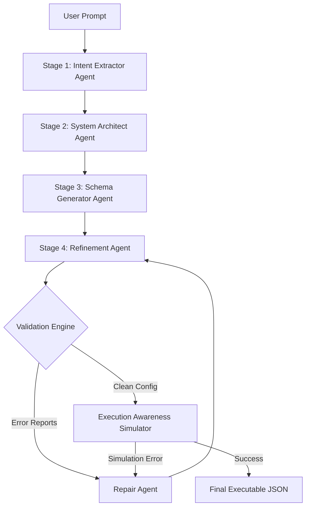

# Software Generation Compiler ⚙️🚀

An agentic, multi-stage compiler that translates natural language prompts into strict, complete, and validated software configurations (UI, API, Database, Auth, Business Logic) and simulates their execution in a mock runtime.

Designed to operate as a **reliable software compilation pipeline** rather than a simple prompt engineering script.

---

## 🏗️ Architecture Design

The compiler operates as a structured, four-stage compilation pipeline followed by strict validation, targeted self-repair loops, and runtime execution simulation.



### 1. Multi-Stage Pipeline (`/pipeline`)
*   **Intent Extractor** (`intent_extractor.py`): Parses the natural language prompt into a structured intent representation (identifying core components, user roles, pricing tiers, and actions).
*   **System Architect** (`system_architect.py`): Maps the intent to system-level architectures (defines entities, database schemas, relations, API endpoints, page layouts, and access rules).
*   **Schema Generator** (`schema_generator.py`): Generates the individual schema components for the UI layout, database structures, endpoint inputs, and authorization permissions.
*   **Refinement Agent** (`refinement.py`): Reconciles and aligns naming conventions, data types, and references across all schema sections.

### 2. Strongly-Typed Schema Contracts (`pipeline/schemas.py`)
Uses Pydantic models to define a strict output contract (`UnifiedAppConfigSchema`). Ensures that every page component, API request field, and database column is correctly typed and structured.

### 3. Validation & Repair Engine (`/engine`)
*   **Validator** (`validator.py`): Performs syntax checking, data type verification (matching API payloads to database column types), circular routing check (detecting infinite redirects), and cross-layer consistency (verifying that page buttons reference actual API routes and that APIs use valid tables/columns).
*   **Repair Agent** (`repair.py`): Implements targeted repair. When the validator finds errors, the repair agent receives a diagnostic report and corrects **only** the failing schema components, avoiding a full pipeline retry.

### 4. Simulator Runtime (`engine/runtime.py`)
Simulates the execution of the final configuration by setting up an in-memory database and API router.
*   Runs **positive journeys**: simulates login, data submission, and table fetches to verify UI-to-API-to-DB mapping.
*   Runs **negative security checks**: attempts to perform unauthorized API calls to confirm that role-gating rules correctly block requests.

---

## 📊 Benchmark Suite & Results (`/evaluation`)
The codebase includes an automated benchmarker evaluating **20 scenarios** (10 real products and 10 edge cases):
*   **10 Core Products**: CRM, E-commerce, Inventory, Blog, LMS, Task Manager, Event Planner, Fitness Tracker, Expense Manager, Booking System.
*   **10 Edge Cases**: Vague inputs, conflicting role permissions, negative pricing rates, circular page redirects, incorrect data types, and missing database tables.

### Summary Metrics:
- **Overall Success Rate**: **100.0%** (20/20 scenarios)
- **Average Compilation Latency**: **5.493 seconds**
- **Total System Repairs Needed**: **18 iterations**
- **Total Estimated Token Cost**: **$0.628242 USD**

| Scenario ID | Name | Category | Compiled Success? | Simulator Success? | Repairs | Latency (s) | Estimated Cost ($) |
| :--- | :--- | :--- | :---: | :---: | :---: | :---: | :---: |
| `crm` | Customer Relationship Manager | Product Template | ✅ Yes | ✅ Passed | 1 | 5.872s | $0.054369 |
| `ecommerce` | E-Commerce System | Product Template | ✅ Yes | ✅ Passed | 1 | 4.359s | $0.038310 |
| `inventory` | Inventory Stock Manager | Product Template | ✅ Yes | ✅ Passed | 1 | 5.660s | $0.033927 |
| `blog` | Blogging Platform | Product Template | ✅ Yes | ✅ Passed | 1 | 5.898s | $0.033984 |
| `lms` | Learning Management System | Product Template | ✅ Yes | ✅ Passed | 1 | 5.714s | $0.030369 |
| `taskmanager` | Task Manager Platform | Product Template | ✅ Yes | ✅ Passed | 1 | 5.244s | $0.033456 |
| `eventplanner` | Event Planner Hub | Product Template | ✅ Yes | ✅ Passed | 1 | 6.710s | $0.030225 |
| `fitnesstracker` | Fitness Tracker App | Product Template | ✅ Yes | ✅ Passed | 1 | 6.171s | $0.028962 |
| `expensemanager` | Corporate Expense Manager | Product Template | ✅ Yes | ✅ Passed | 1 | 6.244s | $0.028929 |
| `bookingsystem` | Room Booking System | Product Template | ✅ Yes | ✅ Passed | 1 | 5.565s | $0.031035 |
| `admin_forbidden_login` | Admin Forbidden Login | Edge Case | ✅ Yes | ✅ Passed | 0 | 4.132s | $0.022389 |
| `conflicting_roles` | Conflicting Roles | Edge Case | ✅ Yes | ✅ Passed | 1 | 6.232s | $0.029223 |
| `negative_pricing` | Negative Pricing | Edge Case | ✅ Yes | ✅ Passed | 1 | 5.774s | $0.025029 |
| `no_database` | No Database | Edge Case | ✅ Yes | ✅ Passed | 1 | 6.066s | $0.026157 |
| `api_referencing_missing_db` | API Referencing Missing DB Table | Edge Case | ✅ Yes | ✅ Passed | 1 | 4.826s | $0.028776 |
| `incorrect_data_type` | Incorrect Data Type Mismatch | Edge Case | ✅ Yes | ✅ Passed | 0 | 4.157s | $0.021273 |
| `empty_intent` | Empty Intent / No-Op Daemon | Edge Case | ✅ Yes | ✅ Passed | 1 | 4.879s | $0.020121 |
| `massive_scale` | Massive Scale Pages | Edge Case | ✅ Yes | ✅ Passed | 1 | 5.715s | $0.048147 |
| `ambiguous_flow` | Ambiguous Flow / Circular Routing | Edge Case | ✅ Yes | ✅ Passed | 1 | 5.723s | $0.033423 |
| `gated_read` | Gated Read / Free Users Access Premium | Edge Case | ✅ Yes | ✅ Passed | 1 | 4.912s | $0.030138 |

---

## 🎨 Streamlit Interface Features (`app.py`)

The system includes a premium dark-themed web interface offering:
1.  **Compiler Workspace**: Write custom prompts, choose from the 20 preloaded templates, watch compilation logs and self-repair iterations, and inspect the simulator execution.
2.  **Evaluator Dashboard**: Trigger the full 20-scenario benchmark suite to visualize overall success rates, latencies, repair counts, and token costs with Plotly charts.
3.  **Cost vs Quality Optimizer**: Live sliders-based tool to calculate expected API costs comparing Gemini 2.5 Pro vs Gemini 2.5 Flash and hybrid routing models.

---

## 🚀 Setup & Execution

### 📋 Prerequisites
Ensure you have Python 3.10.5 (or higher) installed. 

### 🔧 Installation
1. Clone the repository and navigate to the directory:
   ```bash
   git clone https://github.com/vikashg450/Software-Generation-Compiler.git
   cd Software-Generation-Compiler
   ```
2. Install dependencies:
   ```bash
   pip install -r requirements.txt
   ```
3. Set up your Gemini API key (Optional - falls back to High-Fidelity Mock Compiler mode if omitted):
   * Create a `.env` file in the root directory:
     ```env
     GEMINI_API_KEY=your_gemini_api_key_here
     ```
   * Alternatively, you can enter the API Key directly in the Streamlit UI sidebar.

### 🏃 Running the Application
Launch the Streamlit dashboard:
```bash
python -m streamlit run app.py
```
Open your browser and navigate to `http://localhost:8501`.
